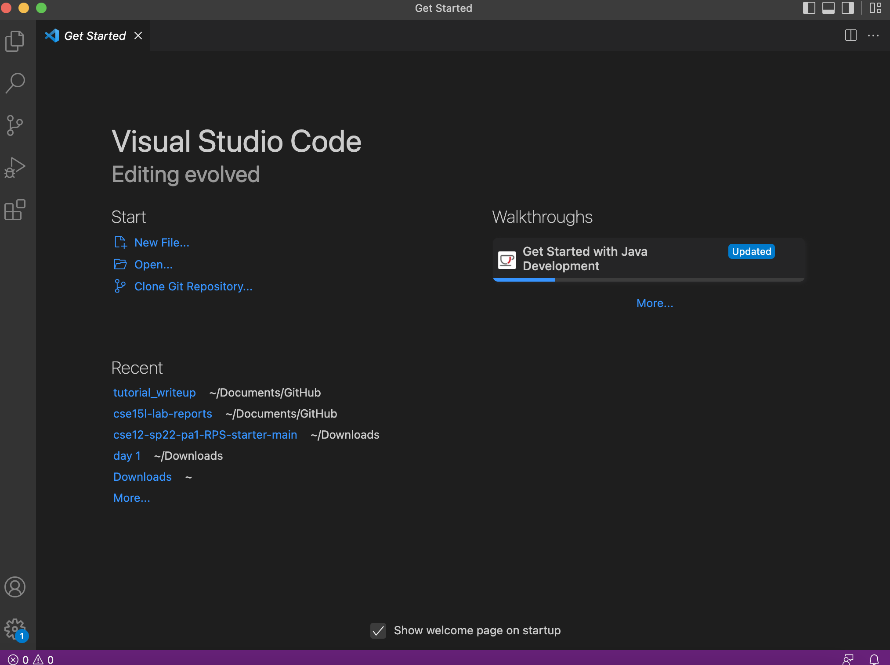
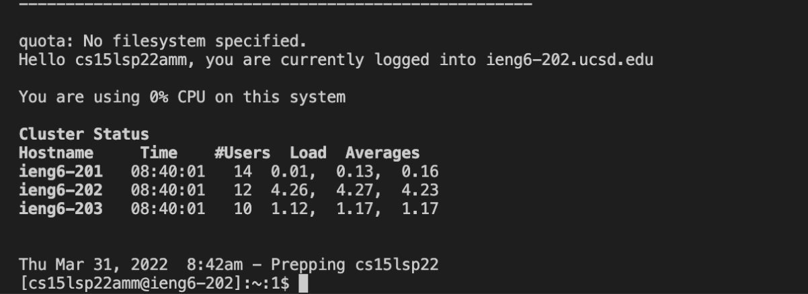
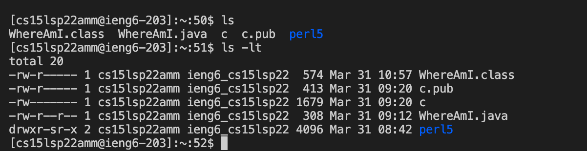
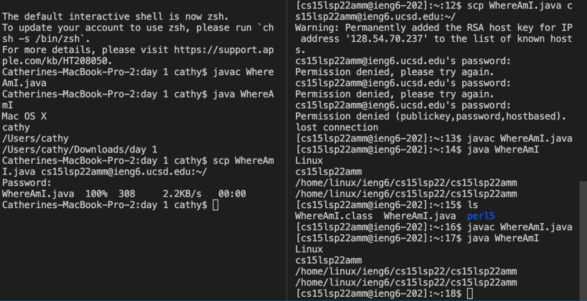
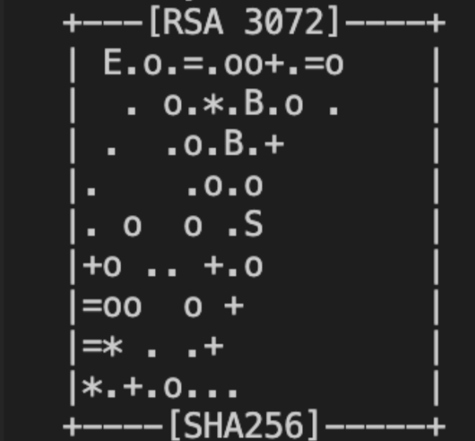

# This is my week 2 lab report that will give a tutorial on how to login to the ieng6 account

**Installing VScode**

1. Download VSCode for your OS, in this report, I will be using a MAC OS.
        - Use this [link](https://code.visualstudio.com/download) to download VSCode
       
2. After you finish downloading VSCode, open the application. Your screen should look someting like this 

**Remotely Connecting**

1. Now that you have VSCode set up, open up the terminal. I recommend splitting the terminal, so you can work on your ieng6 account and your own local account.

        - You can do this my clicking Terminal in the top left corner (for Mac), new terminal, and right clicking your terminal to *split* the terminal.

2. To remotely connect, you will need your ieng6 email and a password that you will create on the server. You can use this [document](https://cdn-uploads.piazza.com/paste/ktv2gnof3sx5bf/181c3cb053df5cf1ccaf0457f56f12a2e5aa90b139aef8c2ea8fcc590f02fadf/How-to-Reset-your-Password.pdf) to change your password for your course-specific account.

3. For my example, my account username is cs15lsp22amm@ieng6.ucsd.edu, and I have my password changed. I will use the ssh command to finally remotely connect. If you are using Windows, you will need to download [this](https://docs.microsoft.com/en-us/windows-server/administration/openssh/openssh_install_firstuse) to utilize the ssh command.

4. Your terminal should look something like this 

**Trying Some Commands**

1. Here are some commands that you can try after connecting remotely

        - You may also just Google Unix Commands to find some commands to test. Here's a website with some basic unix [commands](http://mally.stanford.edu/~sr/computing/basic-unix.html).
2. In my example, I use ls and ls -lt. The third picture below shows the output I got after running these commands. 

**Moving Files with scp**

1. The SCP unix command means secure copy protocol. This is where I mentioned in remotely connecting that splitting the terminal will be beneficial. You want to have your local account and the other for your ieng6 account. 
2. You want to by entering **scp <file you would like to copy>** in your own local account. In my example here , you can see that I want to copy over my file WhereAmI.java.
        
        - It is going to prompt you to enter your password to youe ieng6 account just for vertification. So just enter your password. 
3. And just like that you have copied over a file. 

**Setting a SSH Key**

1. The reason that we want to set up a SSH Key is because it saves time so that we don't have to input a password every time we try to login. It gets time consuming to always have to enter our password and can sometimes interrupt the tasks that we are doing.

2. The first thing is you are going to want to type **ssh-keygen** into the terminal. Then you will be asked to enter a file to save the key. You are going to want to enter **(/Users/<user-name>/.ssh/id_rsa): /Users/<user-name>/.ssh/id_rsa**. However, replace the user-name portion with your user.

3. Next it is going to ask you to enter a passphrase, just click enter and don't enter anything for both times it asks you. 
        
        - It will complete creating an SSH Key and generate your key's randomart image. Every key's randomart image is different for each person. Mine looks like this 
        
4. Now, when you login to your ieng6 account, it will not ask you to enter a password

**Optimizing Remote Running**

1. From this tutorial and my experience in lab, the way that I optimized remote running the most was setting up the SSH Key. As I mentioned in the **Setting a SSH Key**, by settting up a SSH Key, we reduce the time that we spend entering in our passwords constantly. There are other ways to optimize the remote running; however, the ssh keygen is the only method that I have learned so far in CSE15L. 
