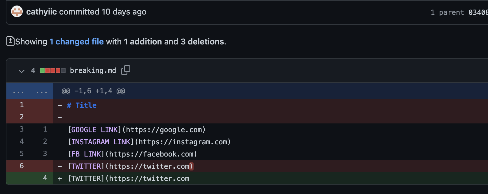
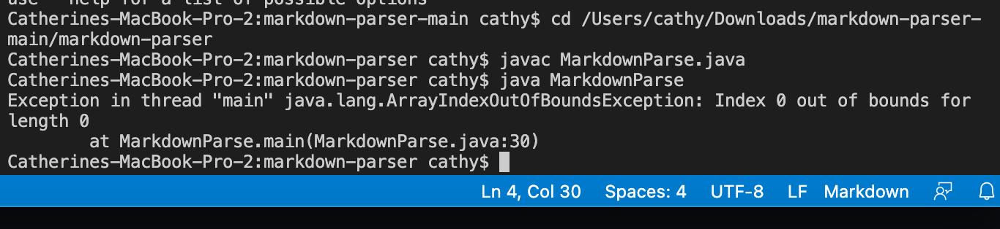

# Here is the Lab Report 2 Week 4

**Three Code Changes That My Lab Group Worked On**
1. One of the first issues that all of my members ran into when we working on Lab 3 was that the MarkdownParse class was throwing an IndexOutOfBounds exception or running an infinite loop. We consulted one of the tutors on this, and she instructed us that the code we wrote for the MarkdownParse class.

```public class MarkdownParse {
    public static ArrayList<String> getLinks(String markdown) {
        ArrayList<String> toReturn = new ArrayList<>();
        // find the next [, then find the ], then find the (, then read link upto next )
        int currentIndex = 0;
        while(currentIndex < markdown.length()) {
            System.out.println(currentIndex);
            int openBracket = markdown.indexOf("[", currentIndex);
            int closeBracket = markdown.indexOf("]", openBracket);
            int openParen = markdown.indexOf("(", currentIndex);
            int closeParen = markdown.indexOf(")", openParen);
            toReturn.add(markdown.substring(openParen + 1, closeParen));
            currentIndex = closeParen + 1;
            System.out.println(currentIndex); //prints the output
        }

        return toReturn;
    }
    public static void main(String[] args) throws IOException {
        Path fileName = Path.of(args[0]);
        String content = Files.readString(fileName);
        ArrayList<String> links = getLinks(content);
	    System.out.println(links);
    }
}
```

The issues here was that the code for the MarkdownParse class is faulty, so if our test file ended with an empty line, it would throw an IndexOutOfBounds exception. Therefore, we had to change our test file to make sure that none of our test files ended with an empty line to avoid this bug from happening again. Here is a screenshot of where the empty line in the test file was deleted in order to avoid the IndexOutOfBounds exception from my Github commit history.

Here is also the output symptom of that failure-inducing input that occurs when there is an empty extra line in our test file. 
!(index out of bounds.png)

2. Another code change that we made was if the test file, breaking.md, had an open parentheses. When linking the link in my breaking.md file, [](https://github.com/cathyiic/cse15l-labreports/blob/main/breaking%201.png) there was an open parentheses for 

```[TWITTER](https://twitter.com```

My group and I fixed this mistake by adding the parentheses at the end of the line. This fixed this symptom errror by adding the parentheses at the end of the line to ensure that our code from the MarkdownParse class will correctly run.

Without fixing the bug, the test file would output an ArrayIndexOutOfBounds exception for us. Here is a screenshot of what the symptom would look like with the failure-inducing input. 


3. Another code change that

