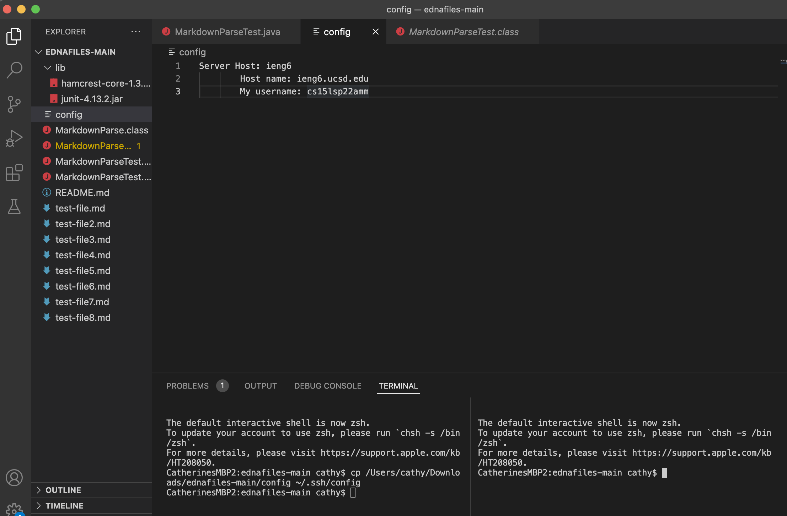

# Here are all of the implementations from Lab 5

**Streamlining ssh Configuration**
Here is my .ssh/config file that I created inside of the file, ednafiles, that we worked on during the last lab. 

