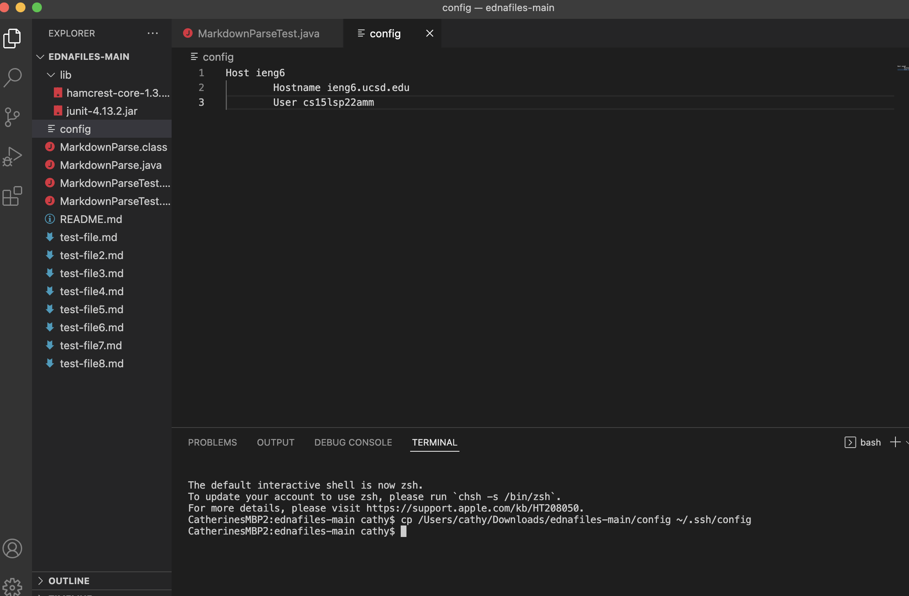
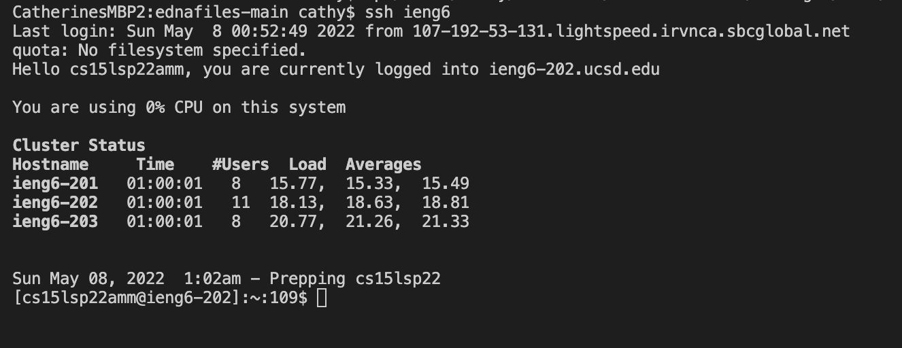
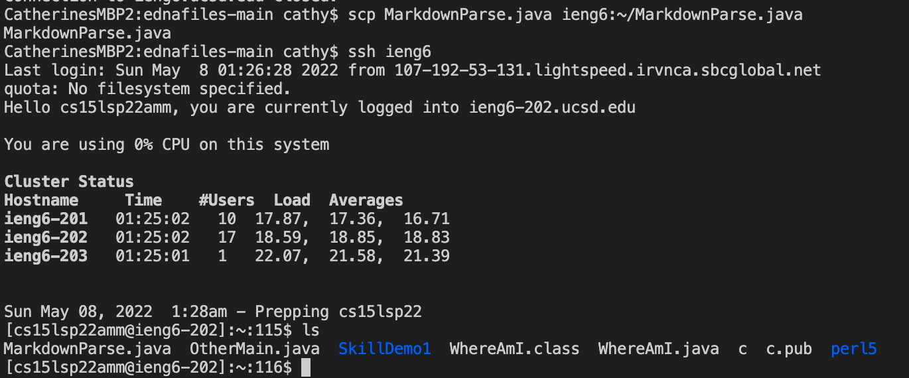
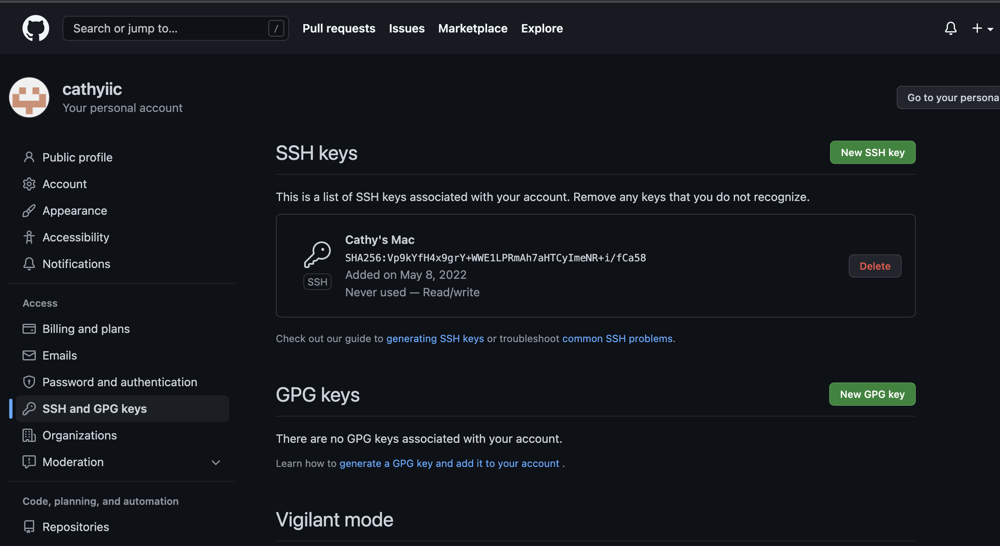
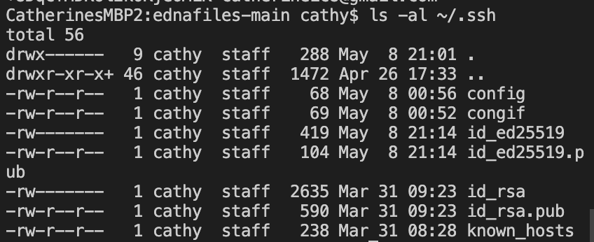
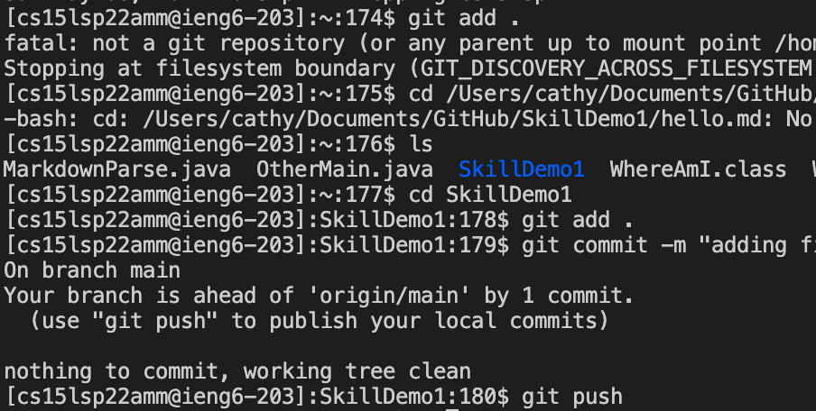
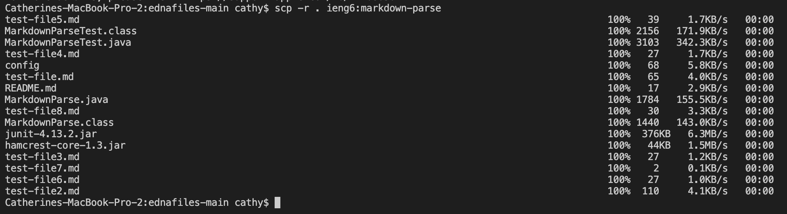
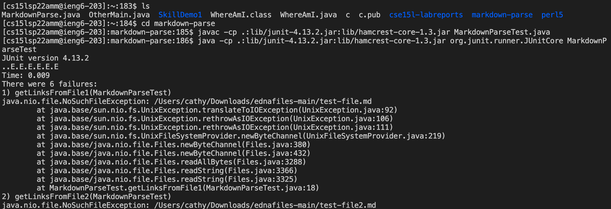
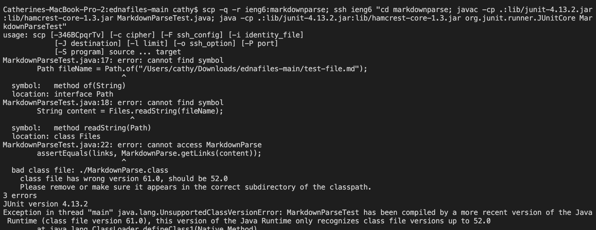
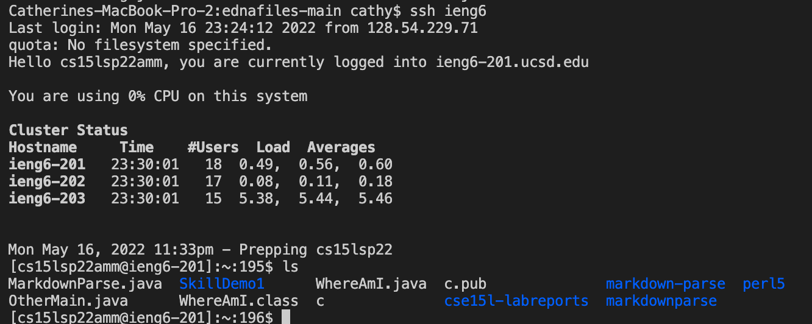

# Here are all of the implementations from Lab 5

**Streamlining ssh Configuration**

Here is my .ssh/config file that I created inside of the file, ednafiles, that we worked on during the last lab. 

In addition, I copied this config file using the `cp` command to copy it to `.ssh/config`.

Here is where I used the ssh command to log into my CSE15L account with my alias. Since I had created the **config** file and written all of my account login info, I can just call `ssh ieng6` to log into my cse15l account.

Here is also another instance where I use the `scp` command to copy the `MarkdownParse.java` from my remote server onto my cse15l account. First, I exit my ieng6 account and went back to my remote server. I ran the `scp MarkdownParse.java ieng6:~/MarkdownParse.java` in my terminal. That copied it over. Then, I logged back into my ieng6 account and called `ls` to check if it copied over and it did!! 

**Setup Github Access from ieng6**

Here is where I have my public key stored in my Github and in my user account. I first had to go to my terminal and use the `ssh-keygen` command to create a new key for my Github account. Then, it used the `cat ~/.ssh/id_ed25519.pub` to find the public key and copied that into Github's area for SSH keys. Here is a screenshot of my key in Github.

For the private key, that is suppose to be only accessible on my private Mac, so I need to use the `ls -al ~/.ssh` command to view where its stored (but not its contents). (Many of the ssh keys stored are my attempts at trying to complete the first step of this section but the private key is stored here)

Here is me using the git commands to add, commit with message, and push to my github the new file that I made in a different file (my SKillDemo file). 

Here is also the commit [history](https://github.com/cathyiic/cse15l-labreports/commit/f4eac68161c2167bd25b1fff0dce08fcaa8299e8) of the new file that I added.

**Copy whole directories with `scp -r`**

Here is me using the `scp -r . ieng6:markdown-parse` command to copy my whole markdown-parse directory to my ieng6 account. 

Here is where I am logging into my ieng6 account after doing this and compiling and running the tests for my repo. (NOTE: I am using the old version of our groupmate's file, ednafiles, so the test files were suppose to fail since we didn't have an updated code and the lab had some questions for debugging not working files)

Here is where I go to the copied markdown-parse directory to then run the test files. I used `ls` to make sure that the directory was copied over with the `scp -r . ieng6:markdown-parse` and as you can see, it was. Then I use the 
`javac -cp .:lib/junit-4.13.2.jar:lib/hamcrest-core-1.3.jar MarkdownParseTest.java
java -cp .:lib/junit-4.13.2.jar:lib/hamcrest-core-1.3.jar org.junit.runner.JUnitCore MarkdownParseTest` and as you can see the files run with jUnit.

Here is is where I combining scp, ;, and ssh to copy the whole directory and run the tests in one line. 

There are some errors that due to the code not working properly, so for the assignment, ignore these errors. :)

I am basically running the same commands as I did above but I am combining them all on one line by using the **";"** to separate each command that would've been on a separate line. 

Here is where I am on my ieng6 account, and I use the `ls` command to check and see that my markdownparse file has copied over successfully with my command.

