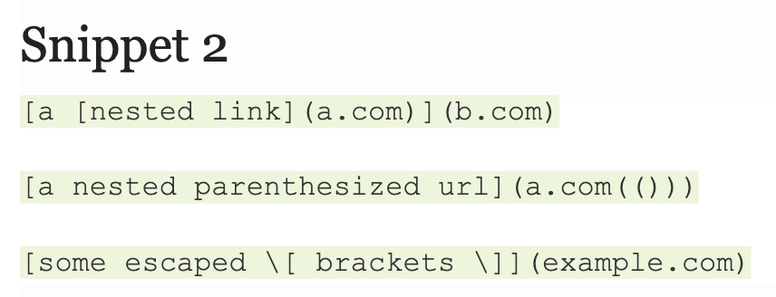
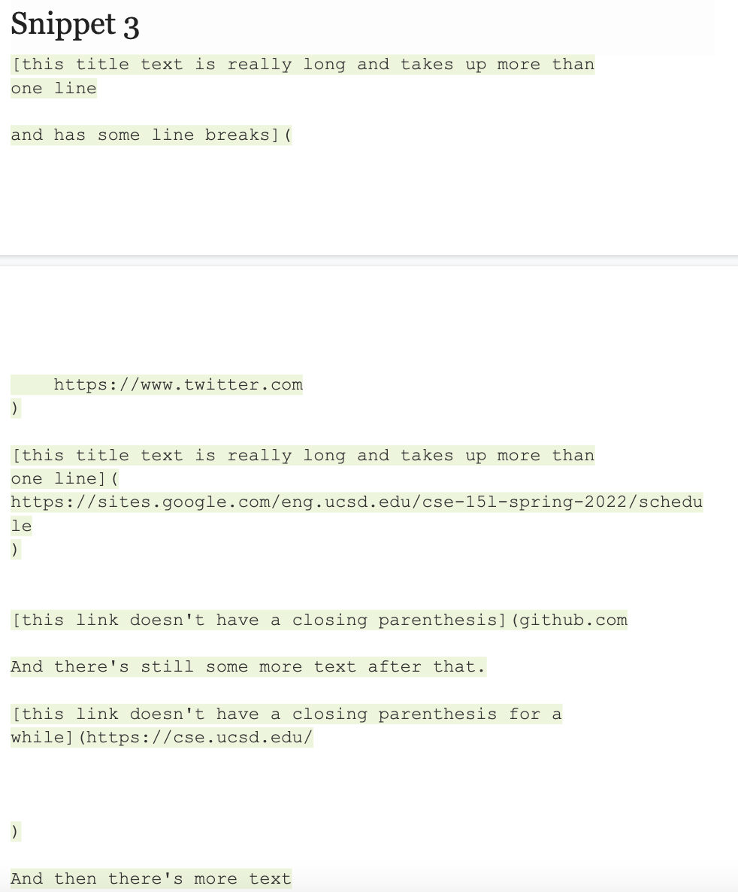

# Here are the testings and implementations that were made in Week 7

**Testing for the first snippet**

**Testing for the second snippet**

**Testing for the third snippet**

**Answering Some of the Questions**

1. *Do you think there is a small (<10 lines) code change that will make your program work for snippet 1 and all related cases that use inline code with backticks? If yes, describe the code change. If not, describe why it would be a more involved change.*
**Yes, I believe that there can be a small code change (in <10 lines) for snippet 1. The code will check for parenthesis and brackets, so after it does so, the code should also check for the ticks and those inside of the brackets. Another part that can be changed in the code is that it can also look to see if there's any additional closed brackets after a tick or another closed bracket, as we see in the last line of snippet 1.**

2. *Do you think there is a small (<10 lines) code change that will make your program work for snippet 2 and all related cases that nest parentheses, brackets, and escaped brackets? If yes, describe the code change. If not, describe why it would be a more involved change.*
**Yes, I believe that there can be a small code change (in <10 lines) for snippet 2. As we see in line 2 of the snippet 2, it should take into consideration any nested punctuation that is happening. That means that the program should check for duplicates and count the pairs of open and closed parentheses to match them up. I think that an even easier fix to this bug is that the program can ignore the nesting, since the nesting isn't important when formatting and focus only on the outside parentheses.**

3. *Do you think there is a small (<10 lines) code change that will make your program work for snippet 3 and all related cases that have newlines in brackets and parentheses? If yes, describe the code change. If not, describe why it would be a more involved change.*
**Yes, I believe that there can be a small code change (in <10 lines) for snippet 3. Before the issue with the code was that it was not taking into account the spaces or empty lines at the end of the file. However, with snippet 3, I think that there is a problem with the large amount of empty spaces in between the text that is because of the line breaks. I think that the code can look at the line breaks and ignore the weird line break formatting but search for the beginning and end of the brackets and the beginning and end of the paranetheses.**

