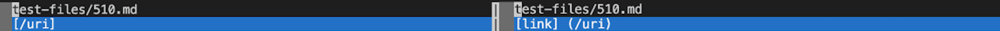
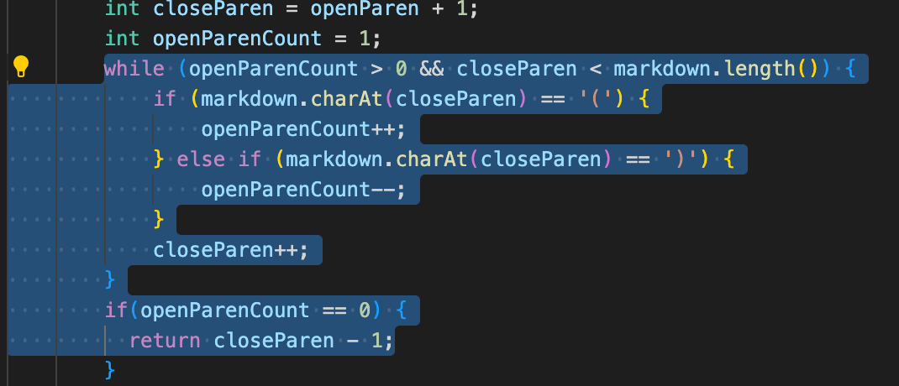
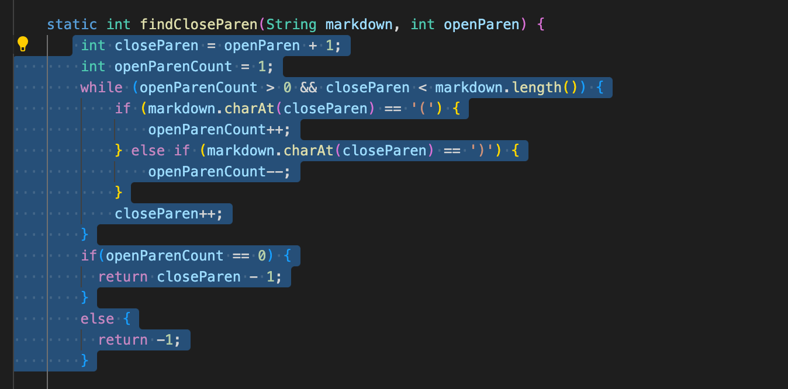

# Here is my lab report 5 for week 10 using the implementations that we experimented with in Week 9

In week 9's lab and in this lab report, I will be using the TA's repo for testing and implementations. [Link](https://github.com/nidhidhamnani/markdown-parser) to the TA's repo.

*When attempting to find the test with different results, I worked with using the `bash script.sh` command. I cloned the **script.sh** from the TA's repo and edited it so that it would run the test file. I assumed that I would have to use the `vimdiff` command that was introduced in week 9 lab, so I created a new file called **my-test** to see how my results would run in comparison to what the ones ran from the TA's code ran.*

**First Test File**

Here is the link to the first test file that I chose to work with, [510.md](https://github.com/nidhidhamnani/markdown-parser/blob/main/test-files/510.md). 

Here is the output after running the `vimdiff` command and comparing the different outputs. The left is the TA's and the right is mine.

Mine should be the correct output with my implementation, because the file doesn't follow the correct markdown syntax. Therefore, it should just input what is in the file, not printing what is in the parentheses. 
Therefore, the expected output should be `[link] (/uri)` which is what mine had an output of.
When I looked through the MarkdownParse class, I assumed that the issue must lie within this part of the code.

I believe that the bug in the code is that there is no area inside of the code where spaces are being taken into consideration. It looks like the code is also overwriting the closed bracket with the closed parentheses which is why it outputted just `[/uri]`. Spaces need to be taken into consideration within the while loops or if statements.

**Second Test File**

Here is the link for the second test file that I chose to work with, [387.md](https://github.com/nidhidhamnani/markdown-parser/blob/main/test-files/387.md).

Here is the output after running the `vimdiff` command and comparing the different outputs. The left is the TA's and the right is mine.

Both of ours had the same output after running vimdiff. However, the issue is that this test file uses two underscores. In markdown syntax, using two underlines means that the text will be bolded and italized. However, in `пристаням__стремятся__`, the `стремятся` portion is not bolded or italized. Therefore, that means there is a bug in both our implementations.

The issue with this test file this time is that it isn't complete with all of the cases that are possible in all of markdown. Therefore, the bug is that we have to write a portion of the code that is also going to look for the underscore pairs and make sure that the underscores work like the open and close brackets do. But the underscores have to count to make sure that there are pairs and that there are two or more pairs of underscores. 
